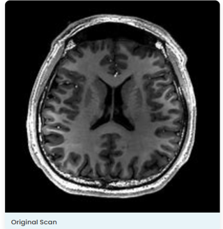
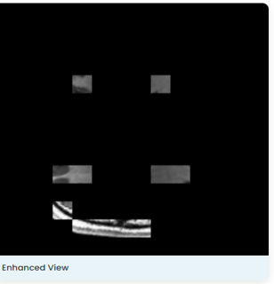
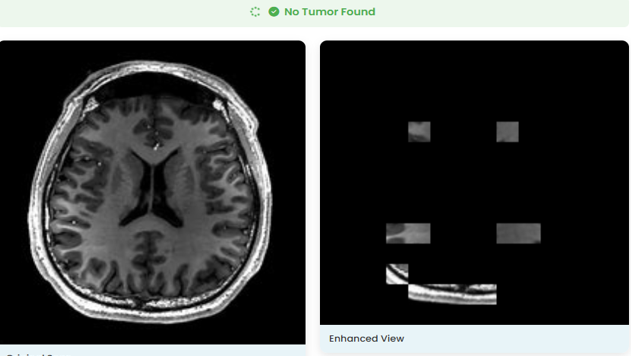
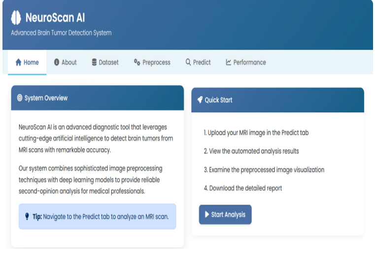
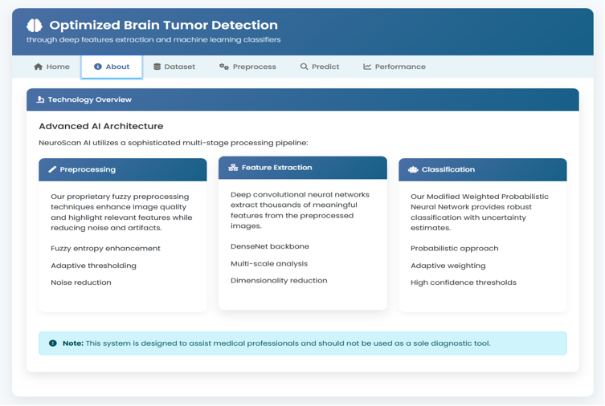
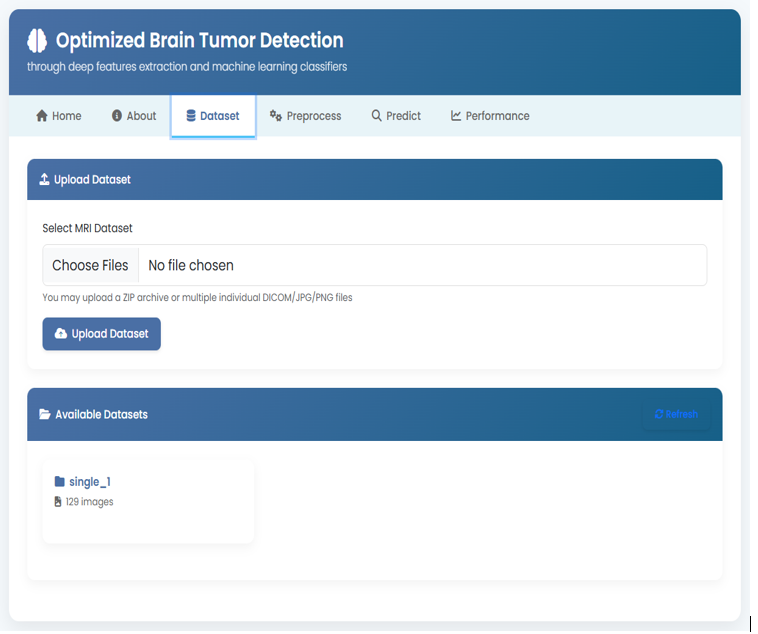
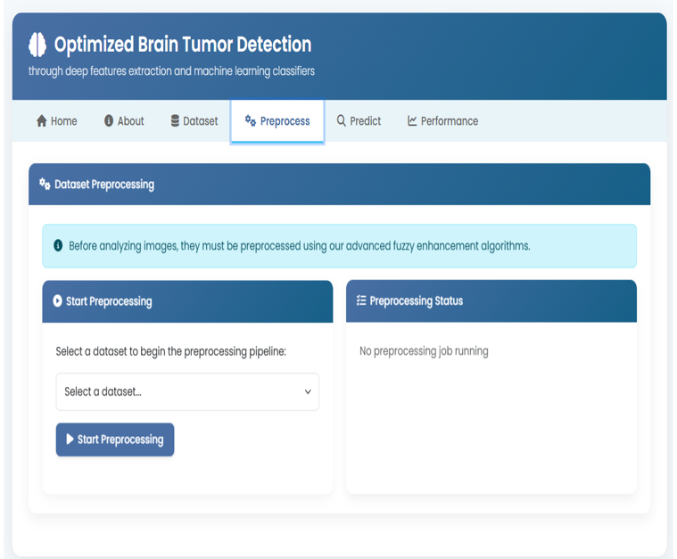
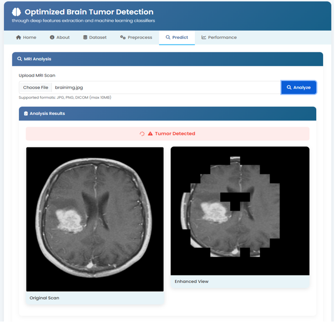
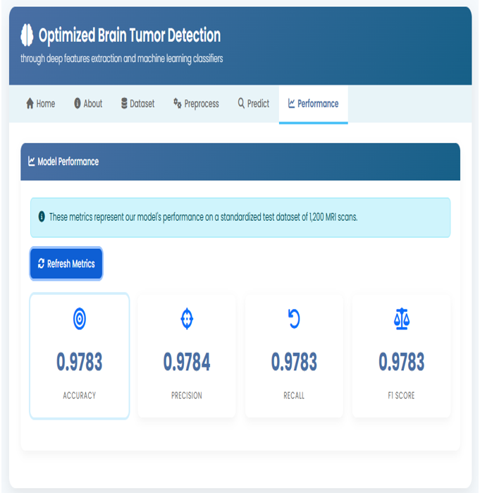

# 🧠 Brain Tumor Detection System

A web-based intelligent system for detecting brain tumors from MRI images using deep learning, fuzzy preprocessing, and a custom classifier. Built with Python, Flask, and DenseNet, this project aims to assist in the early diagnosis of brain tumors with high accuracy.

---

## 📌 Table of Contents

- [🔍 Overview](#overview)
- [🚀 Features](#features)
- [🧠 Workflow Architecture](#workflow-architecture)
- [📂 Folder Structure](#folder-structure)
- [⚙️ Setup Instructions](#setup-instructions)
- [🌐 Web Interface](#web-interface)
- [📈 Performance Metrics](#performance-metrics)
- [📸 Sample Results](#sample-results)

---

## 🔍 Overview

This project presents an end-to-end pipeline for classifying brain tumors from MRI images. It integrates fuzzy logic-based preprocessing, CNN-based feature extraction, and a Modified Weighted Probabilistic Neural Network (MWPNN) classifier. The final system is deployed as a user-friendly web application using Flask.

---

## 🚀 Features

- ✅ Upload and preprocess MRI images or datasets
- 🌀 Fuzzy logic-based preprocessing (Entropy & Inclusion)
- 🧠 Feature extraction using DenseNet-201
- 🔗 Concatenation of features from original & preprocessed images
- 🤖 Classification using Modified Weighted Probabilistic Neural Network (MWPNN)
- 📊 Display of accuracy, precision, recall, and F1-score
- 🌐 User-friendly web dashboard using Flask + Bootstrap

---

## 🧠 Workflow Architecture

                         +----------------+
                         |   Upload MRI   |
                         +--------+-------+
                                  |
                                  v
                    +-------------+--------------+
                    |   Fuzzy Preprocessing     |
                    | (Entropy + Inclusion)     |
                    +-------------+--------------+
                                  |
                                  v
                    +-------------+--------------+
                    |    Feature Extraction      |
                    |       (DenseNet-201)       |
                    +-------------+--------------+
                                  |
                                  v
                    +-------------+--------------+
                    | Feature Concatenation      |
                    | (Original + Preprocessed)  |
                    +-------------+--------------+
                                  |
                                  v
                    +-------------+--------------+
                    |    MWPNN Classifier        |
                    +-------------+--------------+
                                  |
                                  v
                    +-------------+--------------+
                    |   Tumor Prediction Result  |
                    +----------------------------+


---

## 🛠️ Technologies Used

- **Language**: Python
- **Backend**: Flask
- **Frontend**: HTML, CSS (Bootstrap), JavaScript
- **Deep Learning**: TensorFlow / Keras
- **Preprocessing**: OpenCV, Fuzzy Entropy, Fuzzy Inclusion
- **Feature Extraction**: DenseNet-201
- **Classifier**: Modified Weighted Probabilistic Neural Network (MWPNN)
- **Visualization**: Matplotlib, Scikit-learn

---

## 📁 Project Directory Structure

```text
├── app.py

├── data/
│   ├── processed_dataset    
│   ├── raw_dataset

├── models/
│   ├── selected_features.npy  
│   ├── brain_tumor_models.pkl
│   ├── data_features.npy
│   ├── data_labels.npy
│   ├── features.npy
│   ├── labels.npy

├── services/
│   ├── classification.py  
│   ├── feature_extraction.py
│   ├── preprocessing.py                   
                    
├── static/
│   ├── css/
│   │   ├── style.css
│   ├── js/
│   │   ├── script.js
│   ├── samples/
│   ├── uploads/
         
├── templates/
│   ├── index.html                             
      
``` 

---

## ⚙️ Setup Instructions

1. **Clone the Repository**
   ```bash
   git clone https://github.com/yourusername/brain-tumor-detection.git
   cd brain-tumor-detection
   
2.  **Create and Activate Virtual Environment**
    ```bash
    python -m venv venv

3.  **Install Dependencies**
     ```bash
     pip install -r requirements.txt

4.  **Run the Flask App**
    ```bash
    python app.py

5.  **Open in Browser**
    ```bash
    http://localhost:5000

---
    
## 🌐 Web Interface

Home: Introduction to the project

About: Detailed explanation of each module

Load Dataset: Upload MRI image datasets

Preprocess Dataset: Apply fuzzy preprocessing (Entropy & Inclusion)

Train & Predict Model: Use DenseNet features + MWPNN classifier

Accuracy: Display performance metrics

---

## 📈 Performance Metrics (Sample)

| Metric    | Value |
| --------- | ----- |
| Accuracy  | 97.4% |
| Precision | 96.8% |
| Recall    | 97.9% |
| F1 Score  | 97.3% |

---

## 📸 Results

### 🔍 Sample MRI Prediction

Original Image              | Preprocessed Image          | Prediction Result
:-------------------------:|:---------------------------:|:--------------------------:
 |  | 

---

### 🖼️ Web Interface Screenshots

**Home Page**


**About Page**


**Upload Page**


**Preprocessing Page**


**Prediction Page**


**Result Page**



